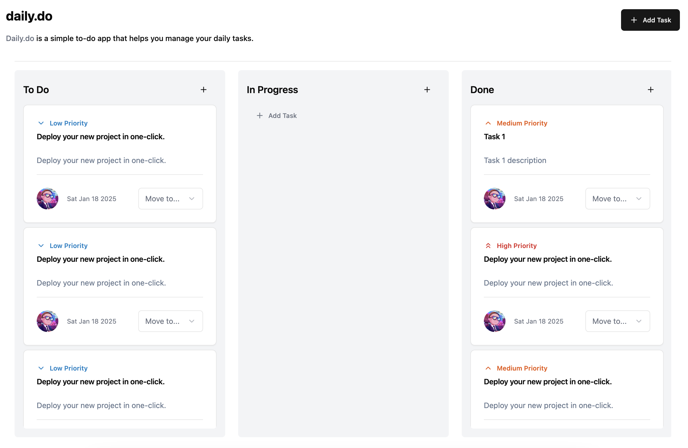

# Daily.do

A simple to-do app to track your daily task built with React, TypeScript, shadcn/ui, and Tailwind CSS.
- Link: https://dailydo.mutiarahns.com/
- Visit my website: [mutiarahns.com](https://mutiarahns.com/)

## 🚀 Features

- Add new task
- Delete tasks
- Mark tasks as completed

## 📷 Screenshots



## 🛠️ Built With

- [React](https://reactjs.org/)
- [TypeScript](https://www.typescriptlang.org/)
- [shadcn/ui](https://ui.shadcn.com/)
- [Tailwind CSS](https://tailwindcss.com/)

## 🚧 Getting Started

To get started, follow these steps:

1. **Clone the repository:**

   ```bash
   git clone https://github.com/mutiarahns/daily.do
   cd daily.do
   ```

2. **Install dependencies:**

   ```bash
   bun install
   ```

3. **Start the development server:**

   ```bash
   bun run dev
   ```
